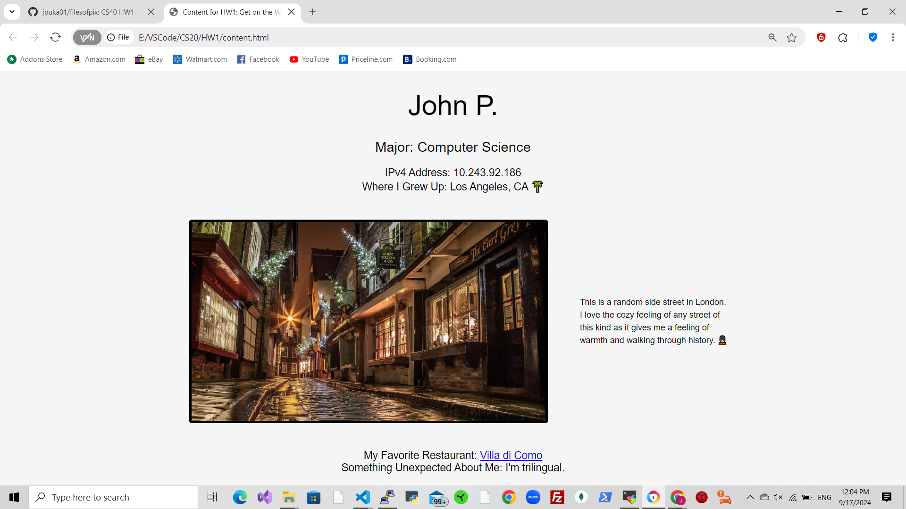
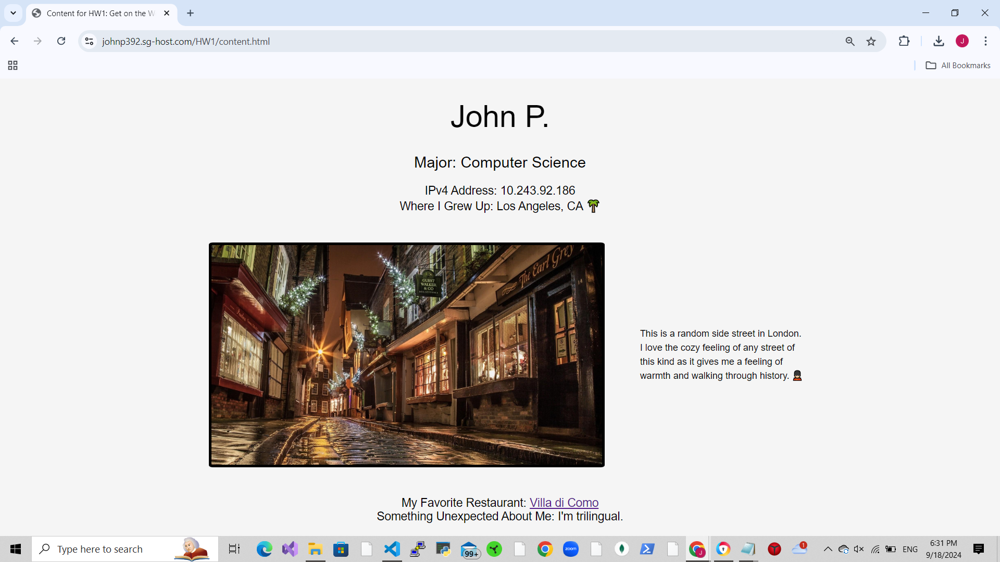
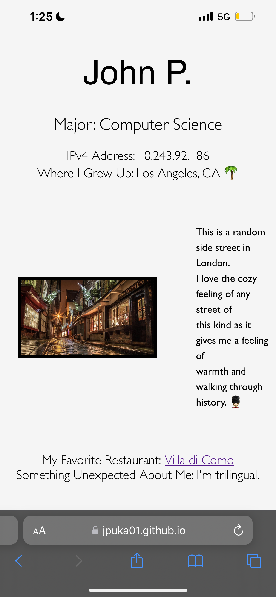

HW1: Get on the Web 

This is a basic site using html and css that introduces a little about myself.

Questions:

1) Name one thing you like about using GitHub and one about using Cpanel 
   hosting.

   I enjoyed the ability to upload my files straight from my terminal in VSCode
   to my repository in GitHub - the process is quick and simple after knowing 
   how to use the basic git commands lines. For cPanel, I also found it really 
   simple to use in terms of uploading files and hosting in a temporary website 
   host.

2) What was the most satisfying part of this assignment?

   I really had fun adding more styling and personalizing my html and css 
   contents. I thought deciding what font to use, what color the background 
   look, and anything else was an intricate process, but nevertheless a good 
   problem to have which I was willing to put my time and effort. This made me 
   appreciate the level of attention to detail of how a good website is 
   structured and produced.

Deliverables:

URL for page on cPanel hosting: 
https://johnp392.sg-host.com/HW1/content.html

URL for page on GitHub hosting: 
https://jpuka01.github.io/johnpuka.github.io/content.html

HTML file uploaded to Canvas

Screenshots:

Page being hosted on my local system

Page hosted on cPanel hosting (SiteGround) from my desktop/laptop

Page screenshot from my phone (SiteGround)

Page screenshot from my phone (GitHub)
